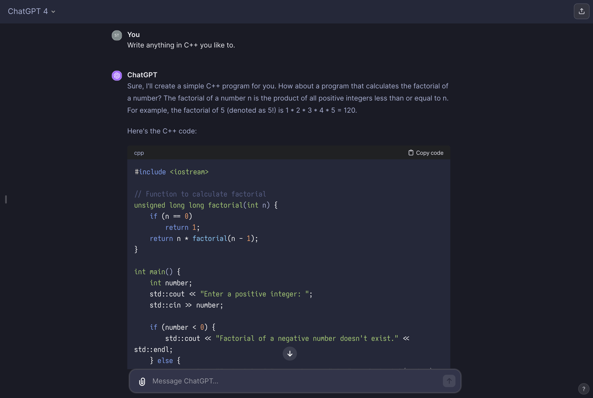

# Tokyo Night Theme for ChatGPT

## Preview



## Why?

1. Tokyo Night is good!
2. For better responsive layout with improved readability.
3. More accessbile by people with vision problems.

## Notice

For better styles, adjusting fonts can be done. As default, `style.css` uses `Interop` and `Iosevka Comfy`. Change these with your favorite ones available locally.

The following parts concern:

```css
:root {
  font-family: "Interop", sans-serif !important;
}

/* Other stuffs... */


code {
  font-family: "Iosevka Comfy", monospace !important;
  font-size: 15px !important;
}

/* Other stuffs... */
```

## Reference

- [Tokyo Night theme for Alacritty](https://github.com/zatchheems/tokyo-night-alacritty-theme)
- [Tokyo Night theme for Helix](https://github.com/helix-editor/helix/wiki/Themes#night)
